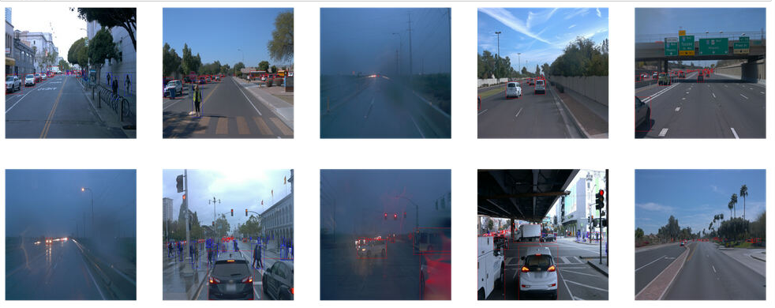
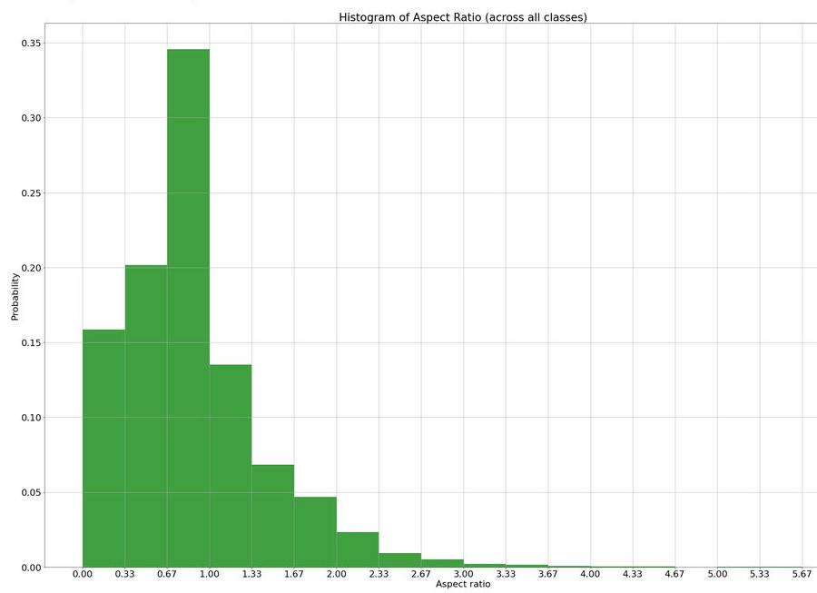
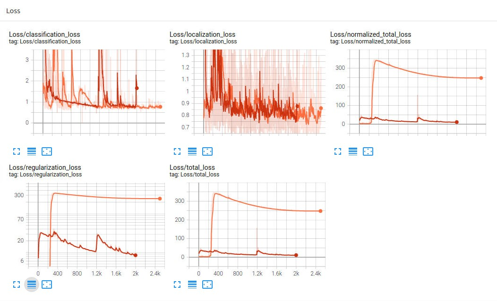
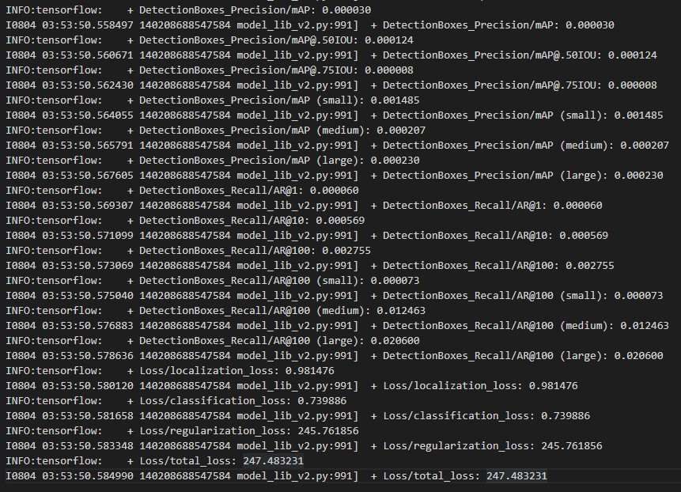
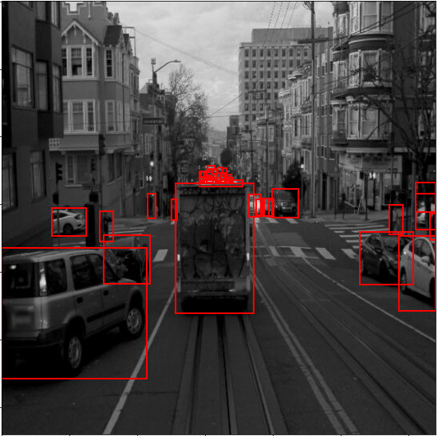
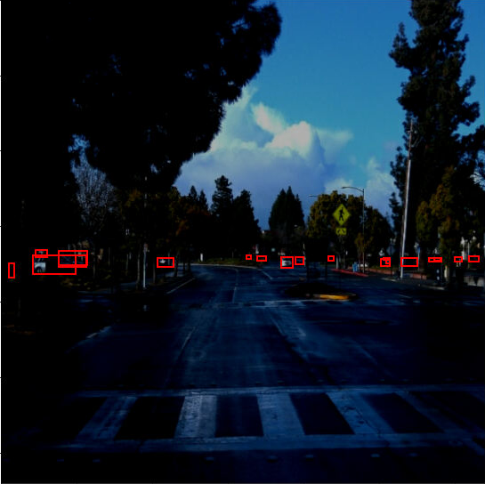
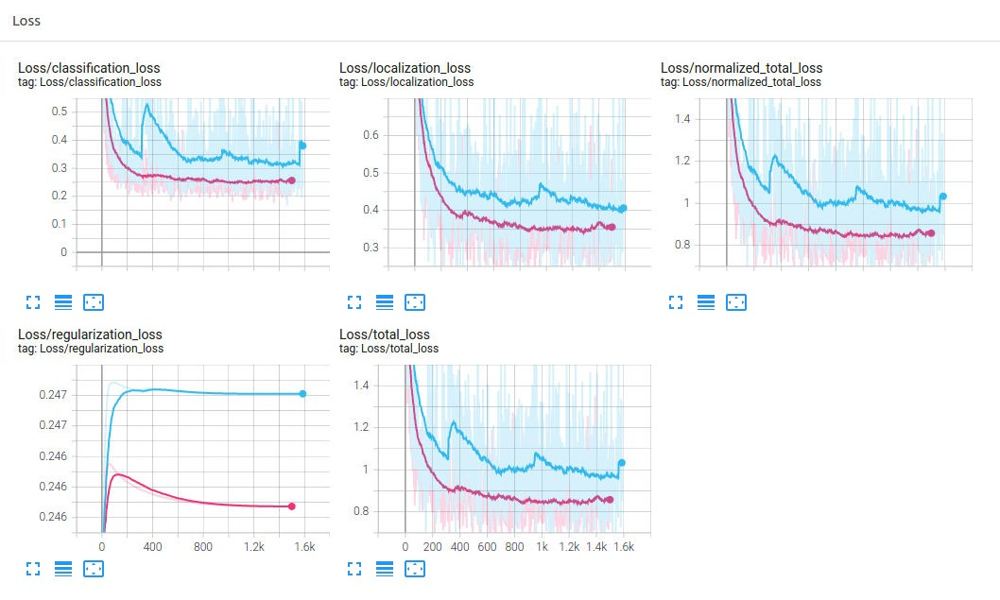
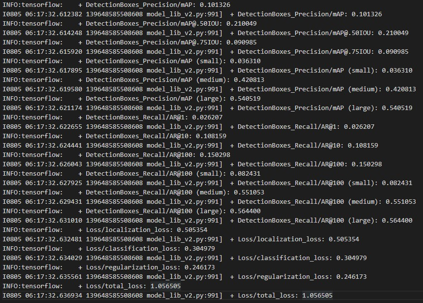

## Overview

The goal of this project is to train an **Object Detection** Network for the purposes of contributing to a self-driving car use-case. At a high level, this involves choosing an appropriate reference model, and then fine-tuning it to our specific dataset & use-case - ie Transfer Learning. We use [Tensorflow Object Detection API](https://github.com/tensorflow/models/tree/master/research/object_detection).

**Object Detection** is a very important component of self-driving car systems in understanding the environment (Perception) around the car, including both static (roads, signs) and dynamic objects (vehicles, pedestrians, bicyles etc). Accuracy & speed (especially at inference time) of the model is critical given the saftey concerns for a self-driving car.

For this project, we trained **SSD Resnet 50 640x640 model**. The final trained model ([experiment2](experiments/exp2-rmspropopt-lr-steps/)) yeilded this annotated video.


## Setup

The steps below describe how you may re-run the models to reproduce the results.

**Note**
1. These must be run form the root directory of this repository, after cloning.
2. Follow steps in [README_starter.md](README_starter.md) to download data and pretrained Model ([direct link](http://download.tensorflow.org/models/object_detection/tf2/20200711/ssd_resnet50_v1_fpn_640x640_coco17_tpu-8.tar.gz)).

### Data
```bash
# Update this to point to your data / sample 
DATA_DIR=/home/workspace/data
SAMPLE_TEST_FILE=${DATA_DIR}/test/segment-12200383401366682847_2552_140_2572_140_with_camera_labels.tfrecord

# This directory has 3 subdirectories containing data in TFRecord files
# - train/
# - val/
# - test/
```

### Scripts
```bash
MODEL_MAIN="python experiments/model_main_tf2.py"
MODEL_EXPORT="python experiments/exporter_main_v2.py"
GEN_INFERENCE_VIDEO="python inference_video.py"
```
### Experiments
3 experiments were run to incrementally try improvements by editing the `pipeline.config` files (especially the `train_config`) for each experiment. 

You can follow the steps below to re-run the experiments (or create your own).

```bash
# Reference Dir
REF_DIR=/home/workspace/experiments/reference
PRETRAINED_MODEL=/home/workspace/experiments/pretrained_model/ssd_resnet50_v1_fpn_640x640_coco17_tpu-8/checkpoint/ckpt-0

# Experiments Dir - Repeat for each experiment
EXP_DIR=/home/workspace/experiments/experiment0
mkdir -p ${EXP_DIR}

# Config File & Edit as needed - This step is optional as the
# updated config files are under each expirmentX/ directory
# python edit_config.py --train_dir ${DATA_DIR}/train/ --eval_dir ${DATA_DIR}/val/ \
#                       --batch_size 2 --checkpoint ${PRETRAINED_MODEL} \
#                       --label_map /home/workspace/experiments/label_map.pbtxt

# Launch Training
${MODEL_MAIN} --model_dir=${EXP_DIR} \
              --pipeline_config_path=${EXP_DIR}/pipeline.config

# Evaluate Model
${MODEL_MAIN} --model_dir=${EXP_DIR} \
              --pipeline_config_path=${EXP_DIR}/pipeline.config \
              --checkpoint_dir=${EXP_DIR}

# Monitor via Tensorboard in browser
python -m tensorboard.main --logdir ${EXP_DIR}/ # --port 6006

# Export Model
${MODEL_EXPORT} --input_type image_tensor \
                --pipeline_config_path ${EXP_DIR}/pipeline.config \
                --trained_checkpoint_dir ${EXP_DIR}/ \
                --output_directory ${EXP_DIR}/exported/

# Generate Inference Video
${GEN_INFERENCE_VIDEO} --labelmap_path label_map.pbtxt \
                       --model_path experiments/${EXP_DIR}/exported/saved_model \
                       --tf_record_path ${SAMPLE_TEST_FILE} \
                       --config_path experiments/${EXP_DIR}/pipeline.config \
                       --output_path ${EXP_DIR}/animation.gif
```

## Dataset
### Dataset Analysis
Visualizing random images showed the variability of the environmnet and objects in the dataset - from clear day to rainy & night conditions, low traffic to high traffic, multiple pedestrians. In general, cyclists seem to be fewer.


Figure 1: Random Images from dataset

Vehicle boxes were in a variety of sizes depending on the vehicle itself(large trucks vs small cars) as well as the proximity of the vehicle. In order to inform the choise of aspect ratios to use for initializing anchor boxes, I generated a **distribution (histogram)** of aspect ratios across a random sample of the data. 


Figure 2: Aspect Ratios Distribution

### Cross-Validation

## Training

See below for a summary of all the training runs. **Experiment2** yielded the best performance.

### Reference experiment

Some observations:
 - The `total_loss` jumped up signicantly to 350 after the warmup window (250 steps). This looks to be due to the sudden jump in the `regularization_loss` at the `learning rate` transition point from warmup to cosine decay.
 - After 2500 steps, the `total_loss` plateaued at ~247.
 
 This chart below shows the **reference** run (and also **experiment0** run, with Adam optimizer & additional aspect ratios. (*Note - experiment0 is included alongside reference to indicate the improvement. experiment1 and 2 are an order(or 2) of mangitude better so they are plotted separately below*)


Figure 3: Reference & Experiment0 Loss


Figure 4: Reference run Evaluation output

### Improvements

#### Optimizer
Given the high regularization loss and plateauing total_loss, I experimented with 3 optimizers - Momentum, Adam & RMSProp. **Adam** (experiment0) improved the overall performance, but the `total_loss` was still relatively high (~25). **RMSProp** yielded the best performance(lowest `total_loss`) at it's default setting.

#### Learning Rate, warmup_window & total_steps
I experimented with different `warmup_steps` and observed that reducing the warmup window as well as `total_steps` didn't impact `total_loss`, while it helped with reducing the overall training time

#### Aspect ratios for Anchor generator
Based on findings during EDA, I included additional *aspect ratios* in the Anchor generator in order to potentially converge localization (bounding boxes) faster

#### Agumentation
Based on EDA findings, to account for various environment conditions related to occlusion & ambient light, I tried the following:

- Random Horizontal Flip
- Random Crop
- Random RGB to Gray
- Random Adjust Brightness
<p align="center">
    &nbsp;&nbsp;&nbsp;&nbsp;
    
</p>
Figure 5: RGB to Gray & Brightness Augmentations


### Overall summary:
|Experiment | Config | Summary of changes | Total Loss |
|---|---|---|---|
|reference|[config](experiments/reference/pipeline.cfg)|default pipeline config, with Momentum optimizer| 247.48 |
|experiment0 |[config](experiments/exp0-adamopt-aspectratio-augment/pipeline.config)| Adam Optimizer, additional aspect ratios & augmentations|~25 |
|experiment1|[config](experiments/exp1-rmspropopt/pipeline.cfg)|same as exp0 + switch to RMSProp optimizer| 1.09 |
|experiment2|[config](experiments/exp2-rmspropopt-lr-steps/pipeline.cfg)|same as exp1 + adjust batch size, learning rates & number of steps| 1.056 |


Figure 6: Experiment1 & Experiment2 Loss


Figure 7: Experiment2 Evaluation Output